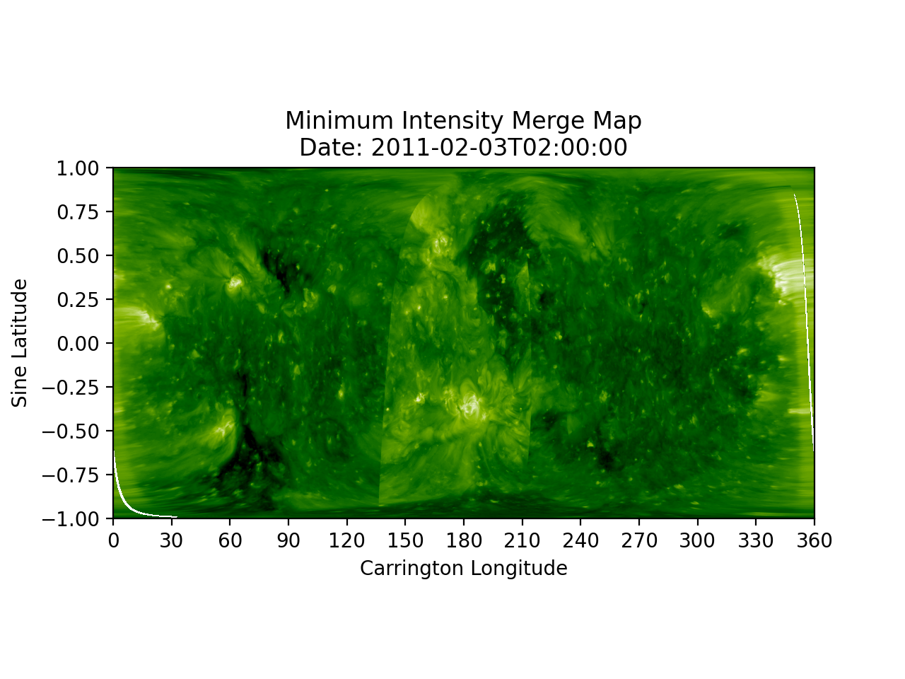

# Coronal Hole Detection

## Example Maps
Example minimum intensity merge maps for February 3, 2011.  

### [Original EUV Map](../img/chd/EUV_map.png)     
   

### [CHD Map](../img/chd/CHD_map.png)  
  

### [Combined EUV/CHD Map](../img/chd/EUV_CHD_map.png)  
  