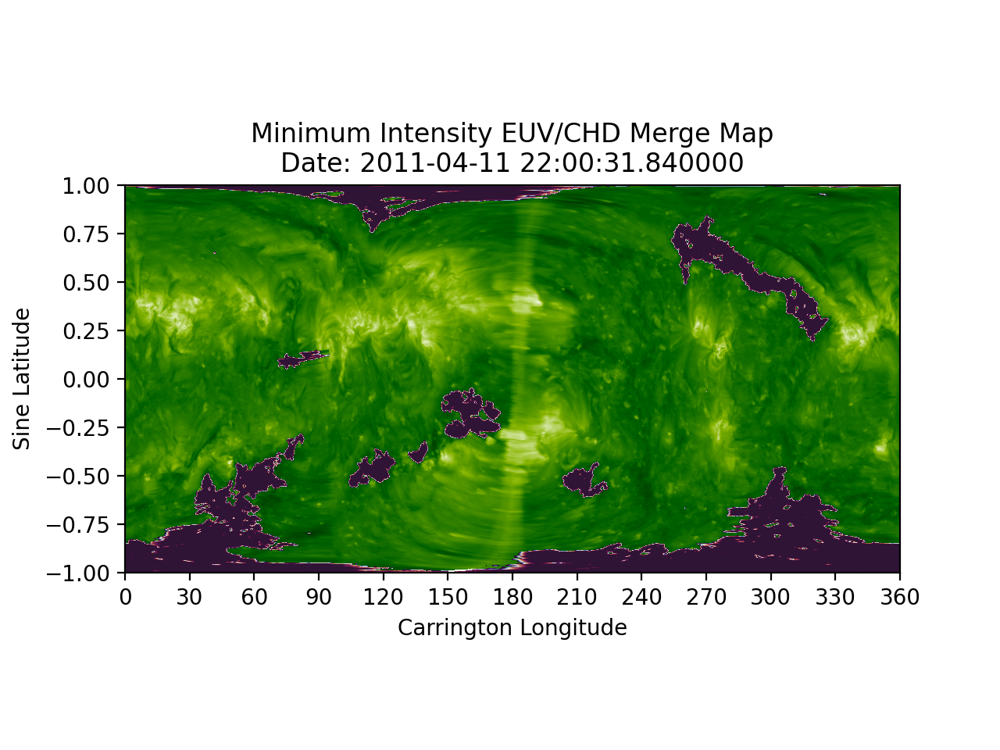
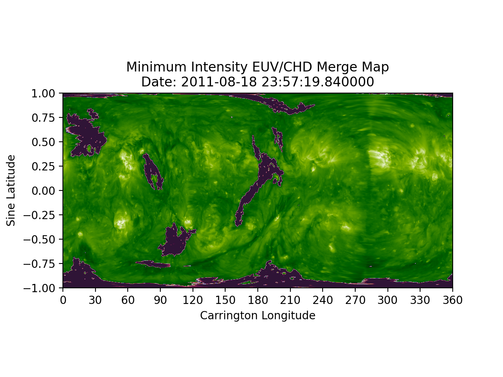
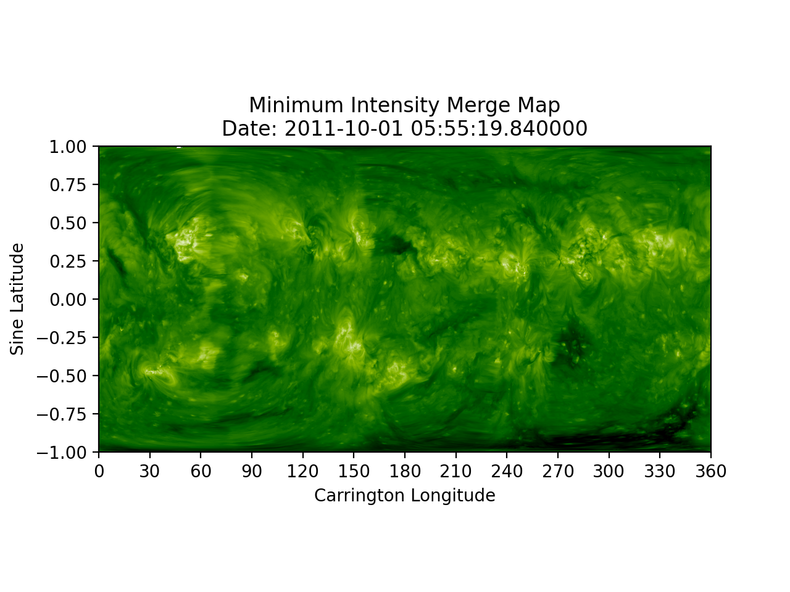
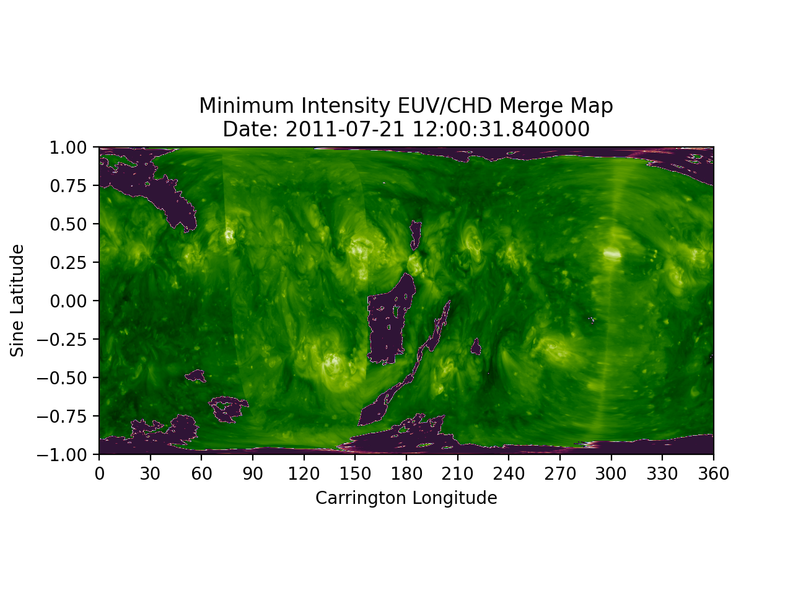
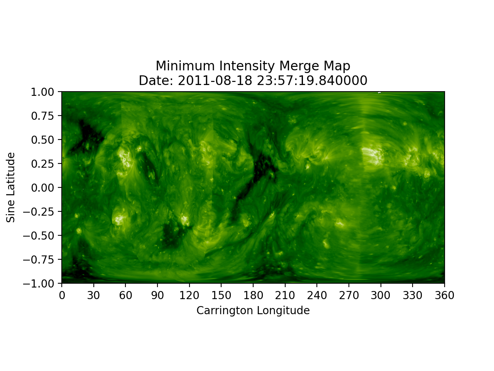
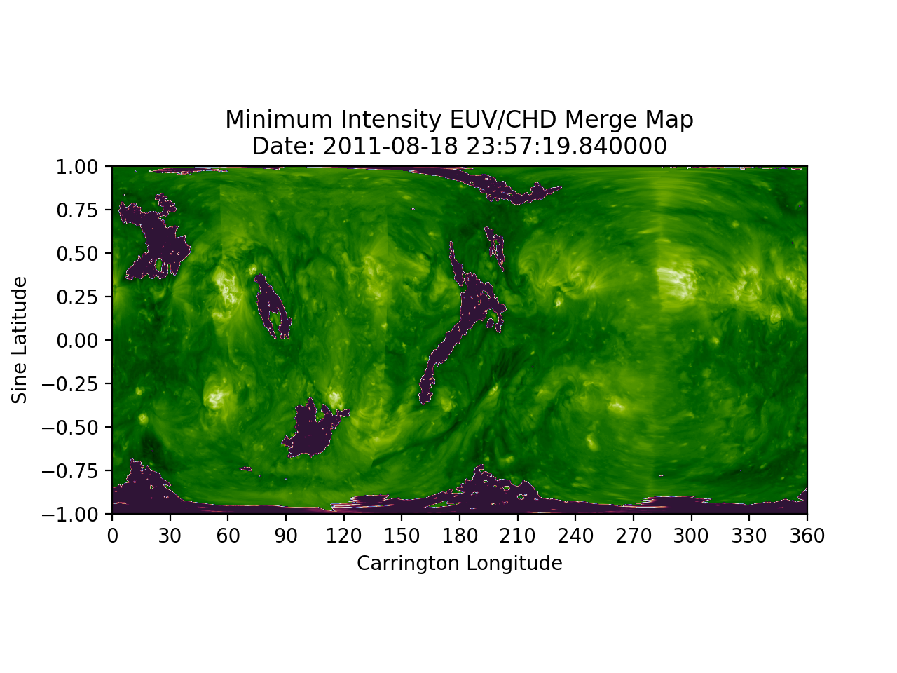
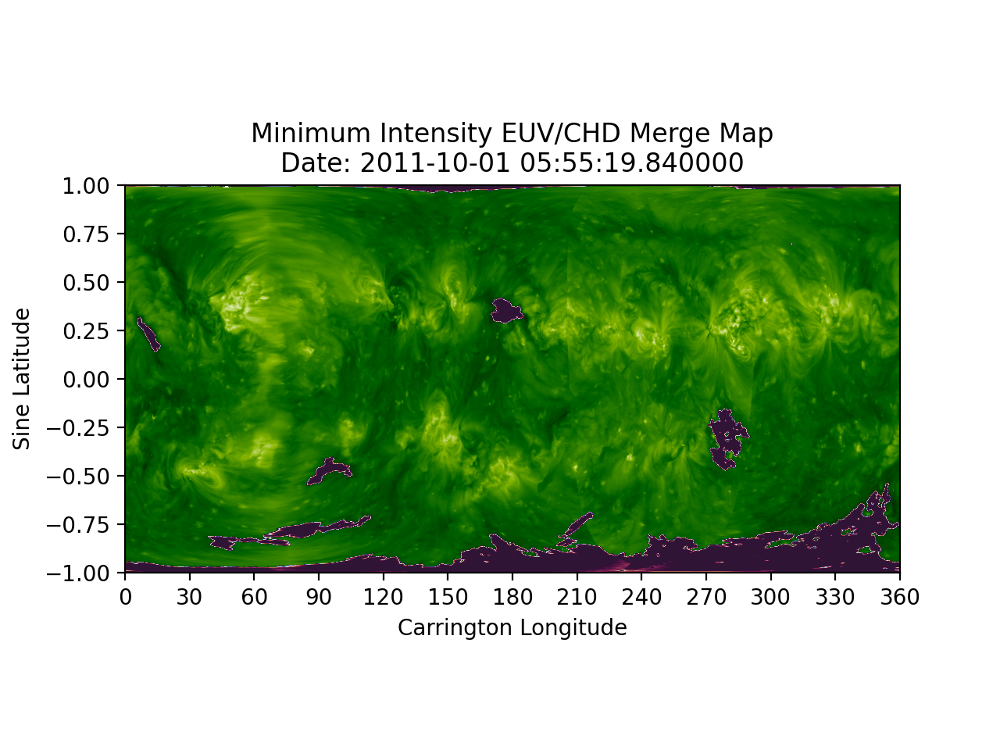

# Coronal Hole Detection
Coronal Hole Detection is carried out using a two-threshold region growing algorithm.  

## Algorithm
```python
"""
python wrapper function for fortran algorithm
@param image_data: EUV Image data for detection
@param use_chd: matrix of size (nx,ny) which contains 1's where there is valid image data, 
                and non-zero values for areas with invalid/no IMG data.
@param nx, ny: image dimensions
@param t1, t2: threshold values
@param nc: pixel connectivity parameter - number of consecutive pixels needed for connectivity
@param iters: maximum number of iterations allowed
@return ezseg_output: segmentation map where 0 marks a detection
@return iters_used: number of iterations preformed
"""
ezseg_output, iters_used = ezsegwrapper.ezseg(np.log10(image_data), use_chd, nx, ny, t1, t2, nc, iters)
```
* 1.) viable pixels are checked to see if the intensity level is below threshold 1  
    * if so, pixel is marked  
* 2.) in each iteration, pixels are checked if their intensity is between threshold 1 and 2, and if they have 
    the required number of connected pixels
    * if so, pixel is marked  
* 3.) continues until no more pixels are marked  


## Example Maps
Example minimum intensity merge maps with and without Coronal Hole Detection overlaid. You can click on image titles to 
enlarge images.

### Minimum Intensity Merge with Mu Cutoff Value
### April 11, 2011
[EUV Map](../img/chd/mu_cut/EUV_20110411.png) | [Combined EUV/CHD Map](../img/chd/mu_cut/EUV_CHD_20110411.png) 
:-: | :-:   
 |   

### May 15, 2011
[EUV Map](../img/chd/mu_cut/EUV_20110515.png) | [Combined EUV/CHD Map](../img/chd/mu_cut/EUV_CHD_20110515.png) 
:-: | :-:   
 |  

### July 21, 2011
[EUV Map](../img/chd/mu_cut/EUV_20110721.png) | [Combined EUV/CHD Map](../img/chd/mu_cut/EUV_CHD_20110721.png) 
:-: | :-:   
 |   

### August 18, 2011
[EUV Map](../img/chd/EUV_20110818.png) | [Combined EUV/CHD Map](../img/chd/mu_cut/EUV_CHD_20110818.png) 
:-: | :-:   
 |   

### October 1, 2011
[EUV Map](../img/chd/mu_cut/EUV_20111001.png) | [Combined EUV/CHD Map](../img/chd/mu_cut/EUV_CHD_20111001.png) 
:-: | :-:   
 |  


### Original Minimum Intensity Merge Method
### April 11, 2011
[EUV Map](../img/chd/EUV_20110411.png) | [Combined EUV/CHD Map](../img/chd/EUV_CHD_20110411.png) 
:-: | :-:   
 |   

### May 15, 2011
[EUV Map](../img/chd/EUV_20110515.png) | [Combined EUV/CHD Map](../img/chd/EUV_CHD_20110515.png) 
:-: | :-:   
 |  

### July 21, 2011
[EUV Map](../img/chd/EUV_20110721.png) | [Combined EUV/CHD Map](../img/chd/EUV_CHD_20110721.png) 
:-: | :-:   
 |   

### August 18, 2011
[EUV Map](../img/chd/EUV_20110818.png) | [Combined EUV/CHD Map](../img/chd/EUV_CHD_20110818.png) 
:-: | :-:   
 |   

### October 1, 2011
[EUV Map](../img/chd/EUV_20111001.png) | [Combined EUV/CHD Map](../img/chd/EUV_CHD_20111001.png) 
:-: | :-:   
 |  