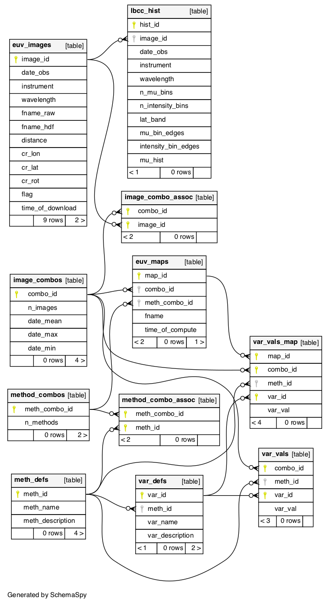

# Database Information
The Image Pre-Processing Pipeline is built upon a [database](https://github.com/predsci/CHD/blob/master/chmap/database/db_classes.py)
 to store images, histograms, and fit parameter values. 

## Updating the Database
The original database is now quite different than the database needed to query and save calculated parameters. In order to generate
the necessary updates to run the code, do the following:  

* 1.) install the python package Alembic in your python environment  
<code>conda install -c conda-forge alembic</code>  
    * additional installation information can be found [here](https://alembic.sqlalchemy.org/en/latest/front.html#installation)  
* 2.) in the (CHD) project folder, run the script to update the database    
<code>alembic upgrade head</code>  
    * this will run the latest updates to the database  
* 3.) to return to the original database, run the downgrade script  
<code>alembic downgrade base</code>
    * this will return the database to it's original form  
* 4.) to only run certain upgrades/downgrades 
    * run a specific number of revisions (n is the number of revisions to either upgrade/downgrade)  
    <code>alembic upgrade +n</code>  
    <code>alembic downgrade -n</code>  
    * run a specific upgrade/downgrade: scripts are found [here](https://github.com/predsci/CHD/blob/master/chmap/alembic/versions)  
    <code>alembic upgrade "revision"</code>  
    <code>alembic downgrade "revision"</code>  
        * "revision" refers to the first 3+ identifying characters from the specific script  
* 5.) to create new update scripts  
    <code>alembic revision -m "revision name"</code>  
    * edit this script with the upgrade/downgrade necessary

## Database Schema

