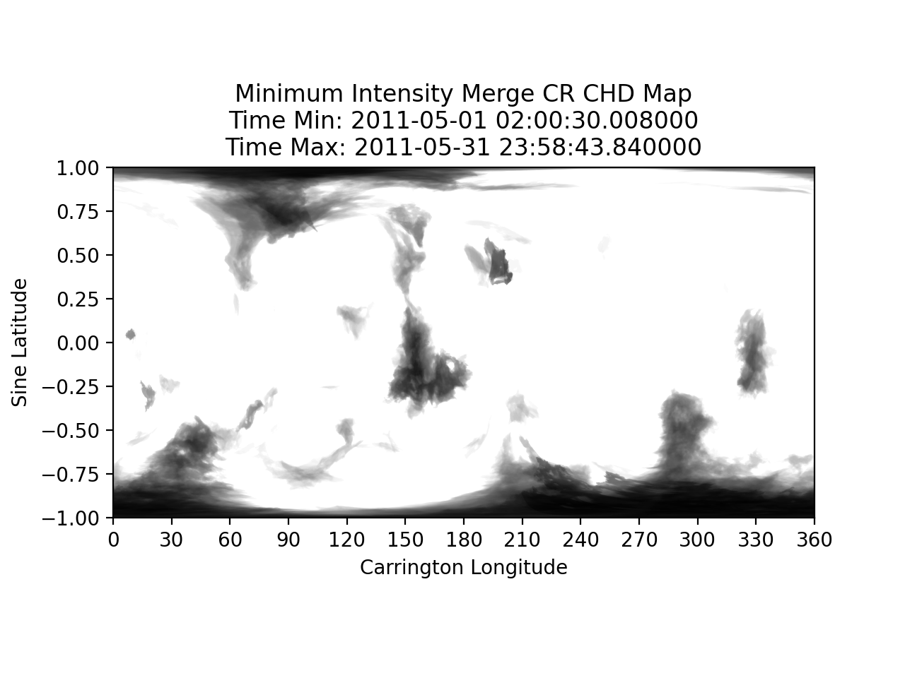
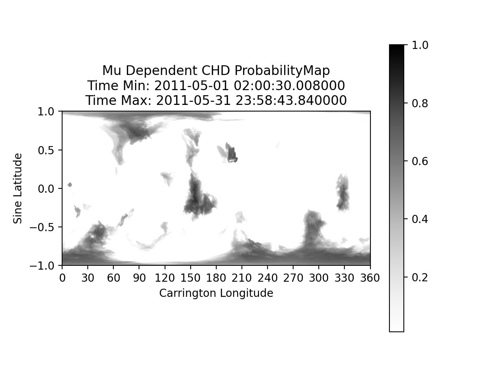

# Full Carrington Rotation Plots

## Example Maps for the Month of June 2011
These example maps used data from June 1 to July 1 2011. The functions to create basic full EUV/CHD Maps can be found
[here](https://github.com/predsci/CHD/blob/master/analysis/chd_analysis/CR_mapping_funcs.py) while the example is 
[here](https://github.com/predsci/CHD/blob/master/analysis/chd_analysis/CHD_fullCR.py).

## [CR EUV Map](../img/dp/full_cr/CR_EUV_Map_052011.png)

## [CR CHD Map](../img/dp/full_cr/CR_CHD_Map_052011.png) 
 

## [Mu-Dependent CR CHD Map](../img/dp/mu_dep/CR_CHD_Mu_052011.png)
