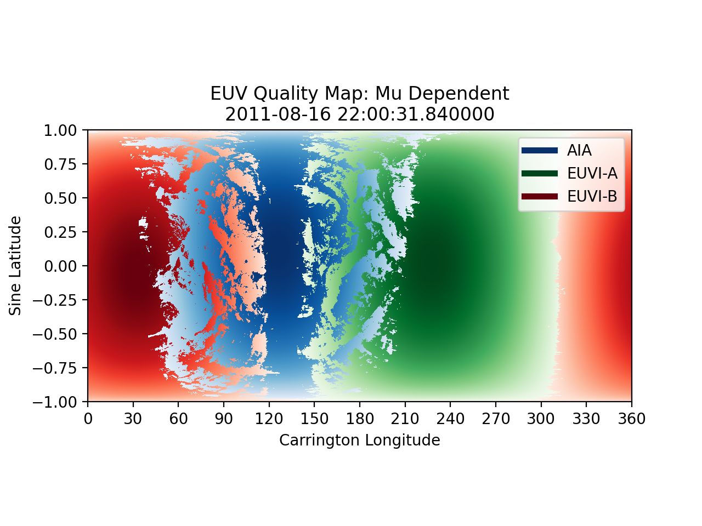

# Quality Assurance Maps

The goal of these maps is to determine where data at each pixel came from, and the mu value of the origin image at that 
point.

## Example Maps
### Synchronic Maps on June 18, 2011 
[EUV Map](../img/dp/qual_map/EUV_Combined_Map_08162011.png) | [Quality EUV Map](../img/dp/qual_map/EUV_Quality_Map_08162011.png) 
:-: | :-: 
 |  

[CHD Map](../img/dp/qual_map/CHD_Map_08162011.png) | [Quality CHD Map](../img/dp/qual_map/CHD_Quality_Map_08162011.png) 
:-: | :-: 
 |  

[Full CR EUV Map](../img/dp/full_cr/CR_EUV_Map_052011.png) | [Quality CR EUV Map](../img/dp/full_cr/EUV_Quality_Map_052011.png)
:-: | :-: 
 | 