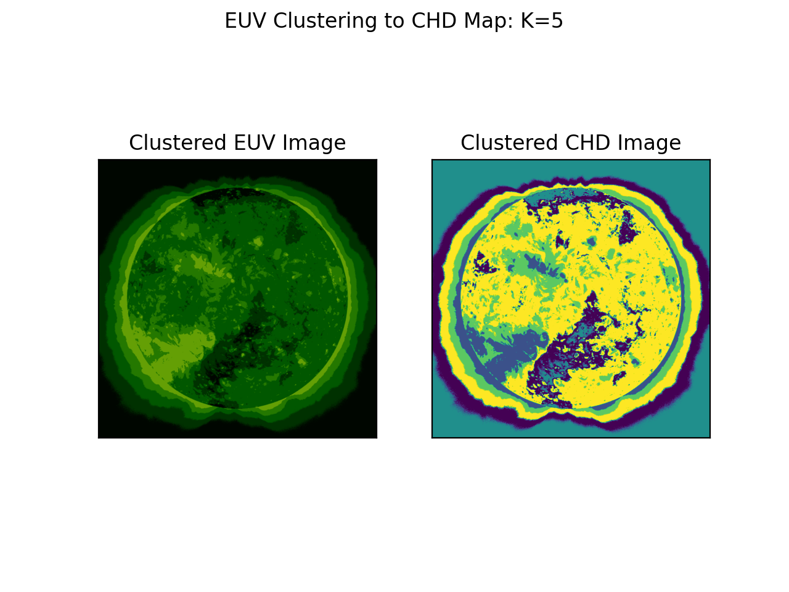

# Techniques to detect coronal holes using neural networks and K-means algorithm

## Where we are
* Fortran region growing algorithm
* CNN Supervised Learning Algorithm
    * advantages: floating point
* GOAL: unsupervised algorithm

## CNN - Supervised Learning to Detect CH

* labeled image data based on Fortran two-threshold detection algorithm
* U-Net Convolutional Network 
* built using tensorflow

### Example Images

####[Test Data](images/pred_test.png)

####[Training Loss](images/train_val_loss.png)

## K-Means Clustering

* unsupervised learning method
* centroid based clustering algorithm to generate CH/non-CH groups

Advantages:  
* unsupervised  
    * no requirement of segmentation masks or labeling  
* easy to create multiple cluster types (find AR as well)  
* can basically regenerate EUV map — use for prediction  

Concerns/Questions:
* can this be trained on a lot of images??  
* can be trained on a lot of data points but thus far that seems like
training on one image  

K-Nearest Neighbor:
* this would allow us to add pixels to a class -- perhaps track a CH over time  

### Example Images

#### Basic Clustering v. CHD

[Two Clusters](images/k2_clusters.png)  

  

[Five Clusters](images/k5_clusters.png)  

  

#### CHD Clustering

[Two Clusters](images/clustering2.png)  

  

[Five Clusters](images/clustering5.png)  

 

#### Predicted CHD

[Two Clusters](images/clustering2_chd.png)  

  

[Five Clusters](images/clustering5_chd.png)  

 

