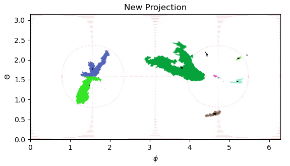
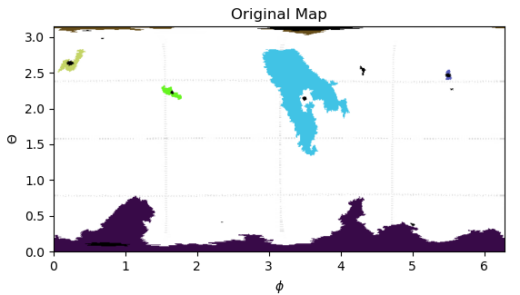

# Coronal Hole Tracking Algorithm 

## Projections
The current images are in latitude longitude coordinates with the poles placed at the top and bottom of the image. In this current projection, clustering coronal holes at the poles is challenging due to the distortion near the poles. In order to overcome this issue, we suggest a coordinate mapping placing the poles at the equator. This transformation can be done in "projection.py" module. 

Input: image dimensions $(n_{\theta}, n_{\phi})$, where $\theta \in [0, \pi]$ and $\phi \in [0, 2\pi]$.

- Step 1: Convert to Cartesian coordinates (x,y,z).
  $x = \rho \sin(\theta)\cos(\phi)$,
  $y = \rho \sin(\theta)\sin(\phi)$,
  $z = \rho \cos(\theta)$,
  where $\rho = 1$. 
  
- Step 2: Rotate about the x axis with $\alpha = \pi/2$.

- Step 3: map back to spherical coordinates ($\theta$, $\phi$).
  $\theta = \arccos(\frac{z}{\rho}) = \arccos(\sin(\theta)\sin(\phi))$,
  $\phi = \arctan(\frac{y}{x}) = \arctan(\frac{-\cos(\theta)}{\sin(\theta)\cos(\phi)})$.

- Step 4: find contours - save coronal holes. 

- Step 5: convert to Cartesian coordinates. 

- Step 6: Rotate about the x axis with $\alpha = -\pi/2$.

- Step 7: map back to spherical coordinates ($\theta$, $\phi$).

- Step 8: Save current coronal hole contour coordinates. 

## Centroid Tracking 
Track coronal holes between frames based on the distance to the previous list of coronal hole centers. 

## Features saved to object: 

- centroid pixel location (x,y)
- centroid physical location (phi, theta) - TODO.
- contour - pixel list.
- contour pixel area.
- contour physical area. - TODO
- coronal hole probability -temporal averaging -gaussian.
- contour arc length.
- bounding rectangle - straight and rotating.