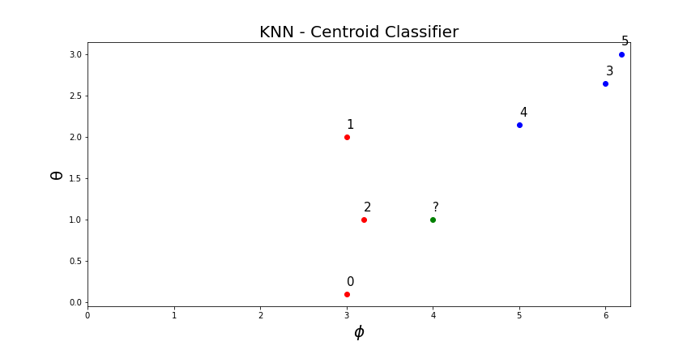
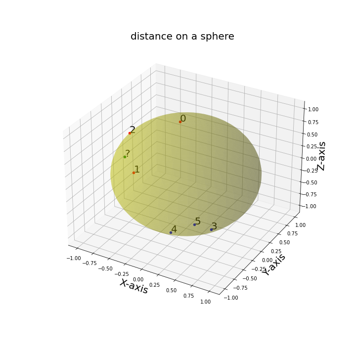

# How to match coronal holes between sequential frames?

# K - Nearest Neighbor Algorithm 

KNN algorithm is a simple supervised machine learning algorithm that is used to solve classification problems. 
KNN is easy to implement and understand. Classification is based on proximity. In our example, we will use the coronal 
hole centroid location to classify its ID number based on previous frames identified coronal holes.  

# KNN settings 
Lets assume we have the following pairs $(X_{1}, Y_{1}), (X_{2}, Y_{2}), ..., (X_{n}, Y_{n})$,
 each pair has a label $(L_{m})$, where $m$ indicates the class associated with the pair. 
The pairs and labeled coronal holes are treated as the *training dataset*. 
Then, given a new unlabled pair $(X_{n+1}, Y_{n+1})$, we classify its associated label by its proximity to 
the pairs in the *training dataset*. K indicates the number of adjacent pairs near the new unlabled point $(X_{n+1}, Y_{n+1})$. Therefore, 
K is a *hyper-parameter*. Based on the nearest K points one can compute the probability associated with each class. 
Then, based on a threshold ($\xi$), the coronal hole can be labeled as an existing coronal hole in the library or be introduced
as a new coronal hole.

# Example of KNN classification

The test sample (green circle) should be classified either to red triangle or blue square. 

* **Case 1**: If K = 3 (solid line circle) then it is 75% red and 25% being blue. 
Based on the threshold ($\xi$) we will either classify the new coronal hole as red or as a new coronal hole. 

* **Case 2**: If K = 5 (dashed circle) then the new coronal hole is 60% blue and 40% red. 
Therefore, in this case when k=5, the new coronal hole will be classified as blue or as a new coronal hole. 
It is important to mention that since the location of the centroid is placed on a sphere, we will use the *haversine*
metric to compute the distance between any two centroids. The *haversine* metric is defined as follows

$$
d = 2 r \arcsin(\sqrt{\sin^{2}((\theta_{1} - \theta_{2})/2) + \cos(\theta_{1})\cos(\theta_{2})\sin^{2}((\phi_{2} - \phi_{1})/2))} )
$$

# Example of KNN classification of *Coronal Holes*

## 1. weighted nearest neighbour classifier

The coronal holes identified in the previous frame will have a larger **weight** than the coronal holes found in the previous 
say 5th frame. The total training data will be composed of the previous 10 frames (this number can be changed as we test it on the images). 
Hence, the weight of each coronal hole would be based on its frame number. 

$$ W_{1}(n) = \frac{1}{n_{last} - n}$$

Therefore, the weight of the coronal hole is proportional to its frame number. 

* We also want to define the weight based on distance? Thoughts?

$$ W_{2}(d) = 1/d$$

Therefore the weight can be some type of combination of the two weights. 

$$W_{final} = W_{1} W_{2}$$

## 2. Distance Metric 

As explained above we will use the *haversine* function. That will also overcome the issue of periodicity.  
Note: "haversine" in sklearn metric requires data in the form of [latitude, longitude] and both inputs and outputs are in units of radians.

## 3. Probability Estimate

The *training* dataset: 
    
    c# (lon, lat)            class
    ================================
    
    0 [3.  0.1]                 red
    
    1 [3. 2.]                   red
    
    2 [3.2 1. ]                 red
    
    3 [6. 2.64]                 blue
    
    4 [5.28 2.5]                blue
    
    5 [6.18  3.]                blue
    
    ? [4, 1]               TO BE COMPUTED

Lets compute the distance between [4, 1] and all the 6 centroids in the library (K=6). 

    d       c#      class
    
    2       0.423    red
    
    1       0.871    red
    
    3       0.926    blue
    
    4       0.988    blue
    
    5       1.131    blue
    
    0       1.18     red

Compute the weighted sum probability based on distance. 

$$
W(X) = [1/1.18, 1/0.871, 1/0.423, 1/0.926, 1/0.988, 1/1.131]
$$

$$
T_{red} = 1/1.18 + 1/0.871 + 1/0.423 = 4.359
$$

$$
T_{blue} = 1/0.926 + 1/0.988 + 1/1.131 = 2.976
$$

$$
P_{red} = \frac{T_{red}}{T_{red} + T_{blue}} = 0.594
$$

$$
P_{blue} = \frac{T_{blue}}{T_{red} + T_{blue}} = 0.405
$$

Predicted probability of [4, 1] is as follows:

0.594 and 0.405 for class red and blue respectively. Since $P_{red} > P_{blue}$ then it is more 
likely [4, 1] is of class red, yet the probability is close to 50/50 therefore we should set a threshold to classify such cases to be 
new coronal holes. 

## 4. How do we choose the optimal K? 

The default K is 5. If we have few frames or total coronal holes in the library we should alter this number. 
* Note: small perturbations in K will not effect the solution of the WKNN algorithm. 

# Implementation steps in Python

*sklearn* library implemented KNN algorithm is called *KNeighborsClassifier()*. 

    from sklearn.neighbors import KNeighborsClassifier
    

### Step 1
Prepare the *training* dataset. This information is saved in Coronal Hole DB. Access the latest five frames centroid location 
$(\phi, \theta)$ and corresponding frame number. Organize this information in the following form:

$$
X = [[\phi_{1}, \theta_{1}], [\phi_{2}, \theta_{2}], ... [\phi_{n}, \theta_{n}]]
$$

$$
Y = [ID_{1}, ID_{2}, .... ID_{n}]
$$

$$
F = [f_{1}, f_{2}, .... , f_{n}]
$$

Where $X$ is the centroid location in longitude and latitude (radians), $Y$ is the corresponding ID number, and 
$F$ is the frame number. 

### Step 2
Use the built in sklearn KNN algorithm to find the distance between the K- nearest neighbors. See Jupyter Notebook for 
a quick tutorial explaining the code below. 

    >>> #sklearn classified
    >>> clf = KNeighborsClassifier(n_neighbors=6, metric=vincenty/haversine)
    
    >>> # fit the training data
    >>> clf.fit(X, Y)
    
    >>> # find the distance between the k nearest centroids to the new coronal hole. 
    >>> clf.kneighbors([[4, 1]])
    (array([[0.42397562, 0.87152123, 0.92636638, 0.98801916, 1.13048736,
         1.18696572]]),
     array([[2, 1, 3, 4, 5, 0]]))
    
    >>> # compute weighted probability
    >>> def weight(ch, last_frame_num):
           return 1/(last_frame_num - ch.frame_num)
     
    >>> # based on a threshold decide if it should be classified as an existing coronal 
            hole or a new coronal hole in database. 
 
 
### Step 3
Update the database with new classification. 
