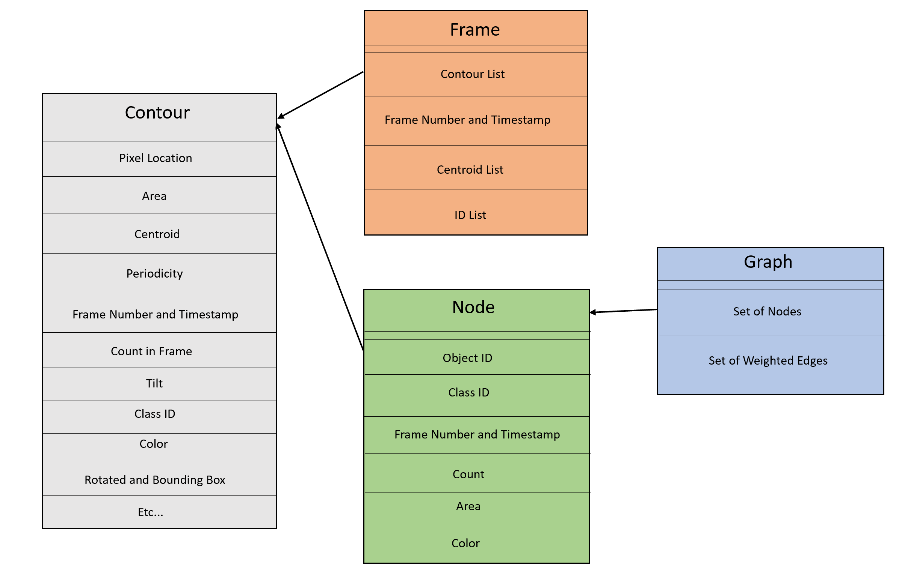

# Coronal Hole Tracking (CHT) Algorithm

## Synopsis
Solar coronal holes (CHs) are regions of open magnetic fields resulting in streams 
of relatively fast solar wind. Such coronal holes can impact Earth's magnetosphere
and can cause geomagnetic storming. Because of their potential impact, detecting and
tracking coronal holes is of great interest. In order to investigate the evolution of
well-observed and long-lived CH, we developed a robust method for automatic tracking of
CHs between sequential multi-instrument EUV/CH synchronic maps. The tracking algorithm identifies
connectivity, open magnetic flux regions, and computes CH features such as area,
center of mass, tilt, etc... as a function of time. This tracking algorithm leverages morphological
image processing and machine learning techniques. We tested and verified this method on
the several time periods and obtained state-of-the-art results.

***Keywords*** - Solar Physics, Coronal Holes, Image Processing, Object Tracking, Machine Learning, Computer Vision.

## Overview
Our goal is to automatically track and classify CHs that appear in a video sequence. 
In addition, we aim to identify both CHs merging and splitting by a connectivity graph.
The tracking algorithm consists of four main phases: (1) classifying coronal holes using a latitude 
weighted dilation, (2) computing coronal hole spatio-temporal features such as area, center of mass, 
rotated and straight bounding box, convex hull, tilt, etc... (3) matching coronal holes between sequential 
frames, and (4) coronal hole connectivity graph.

## Implementation
Data structures used in the tracking algorithm. 

