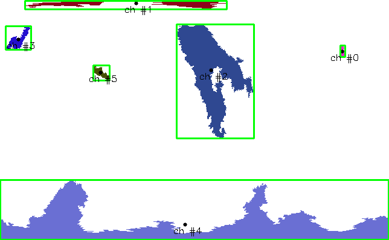

# Coronal Hole Tracking Algorithm 

## Projections
The current images are in latitude longitude coordinates with the poles placed at the top and bottom of the image. In this current projection, clustering coronal holes at the poles is challenging due to the distortion near the poles. In order to overcome this issue, we suggest a coordinate mapping placing the poles at the equator. This transformation can be done in "projection.py" module. 

Input: image dimensions $(n_{\theta}, n_{\phi})$, where $\theta \in [0, \pi]$ and $\phi \in [0, 2\pi]$.

- Step 1: Convert to Cartesian coordinates (x,y,z).
  $x = \rho \sin(\theta)\cos(\phi)$,
  $y = \rho \sin(\theta)\sin(\phi)$,
  $z = \rho \cos(\theta)$,
  where $\rho = 1$. 
  
- Step 2: Rotate about the x axis with $\alpha = \pi/2$.

- Step 3: map back to spherical coordinates ($\theta$, $\phi$).
  $\theta = \arccos(\frac{z}{\rho}) = \arccos(\sin(\theta)\sin(\phi))$,
  $\phi = \arctan(\frac{y}{x}) = \arctan(\frac{-\cos(\theta)}{\sin(\theta)\cos(\phi)})$.

- Step 4: find contours - save coronal holes. 

- Step 5: convert to Cartesian coordinates. 

- Step 6: Rotate about the x axis with $\alpha = -\pi/2$.

- Step 7: map back to spherical coordinates ($\theta$, $\phi$).

- Step 8: Save current coronal hole contour coordinates. 

## Centroid Tracking 
Track coronal holes between frames based on the distance to the previous list of coronal hole centers. 

## Features saved to object: 

- centroid pixel location (x,y)
- centroid physical location (phi, theta) 
- contour - pixel list.
- contour pixel area.
- contour physical area. 
- bounding rectangle - straight.

## January 18th notes - updates

the current tracking algortihm logic: 

input = coronal hole detection image.

* step 1: convert to grayscale. 

* step 2: convert grayscaled image to polar projection. 

* step 3: find contours + save ch id + color assigned + match to previous frame. 

* step 4: map back to lat-lon projection as rbg image. 

* step 5: save the new contour pixels location. 

* step 6: compute contour features (center, area, bounding box). 

## January 19th notes - TODO List. 
1. Add periodicity to the tracking algorithm otherwise a coronal hole center will be falsified. 
See figure below:

2. Print/save all features to a log file. 

3. Match coronal holes based on previous 5 frames!

## Projection Analysis. 

In lat-lon projection:  

 * z < -1/2 or z > 1/2. 
        
  $x = \rho \sin(\theta)\cos(\phi)$,
  $y = \rho \sin(\theta)\sin(\phi)$,
  $z = \rho \cos(\theta)$,
  where $\rho = 1$. 
  
  $\theta$ < $\pi/4$ or  $\theta$ > $3\pi/4$. 

In polar projection: z < -1/2 or z > 1/2. 

[1 0 0, 0 0 -1, 0 1 0] $\cdot$ [$\rho \sin(\theta)\cos(\phi)$, $\rho \sin(\theta)\sin(\phi)$, $\rho \cos(\theta)$] = 
[ $\rho \sin(\theta)\cos(\phi)$, - $\rho \cos(\theta)$, $\rho \sin(\theta)\sin(\phi)$]. 

Then, $\rho \sin(\theta)\sin(\phi)$ < -0.5 or $\rho \sin(\theta)\sin(\phi)$ > 0.5

