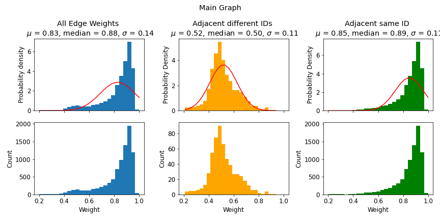
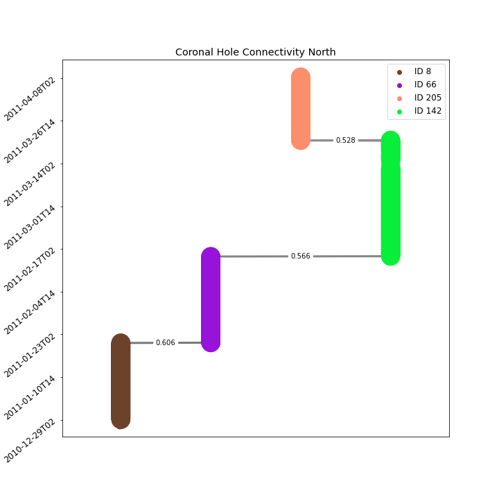
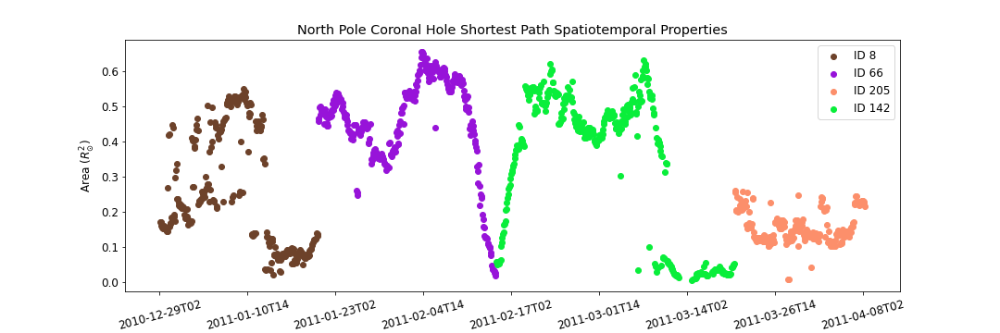
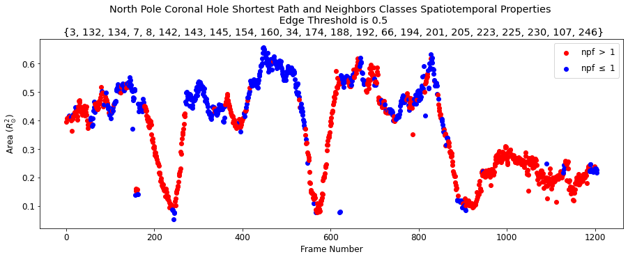
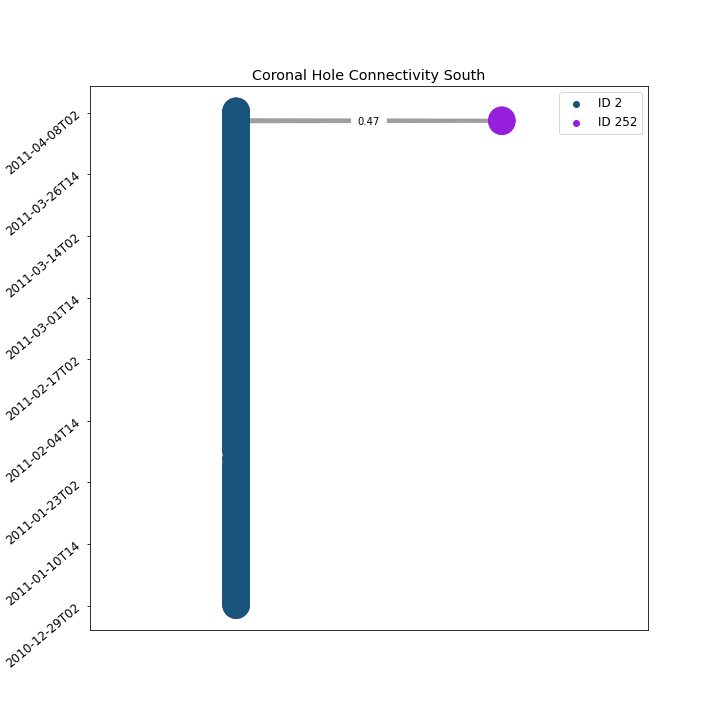
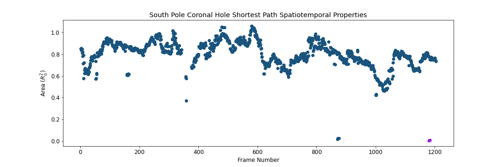
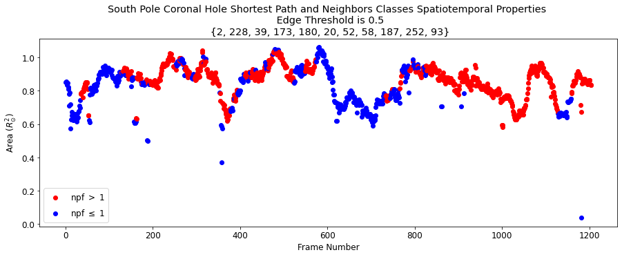

The following section will analyze the results of the tracking algorithm on the 
time interval of 100 days from December 29th, 2010 to April 8th, 2011 (with 2 hr cadence).

## Graph Results

- Total number of nodes:  **8467**
- Total number of edges:  **8742**
- Number of edges between nodes of the same ID: **8172**
- Number of edges between nodes with different ID: **570**
- Total number of subplots:  **210**

## Graph Traversal

Graph Traversal refers to the process of searching each edge in a graph. How can we find the optimal path that will 
represent the spacial temporal evolution of a given coronal hole? We can think about traversing the coronal hole 
connectivity graph as a variant of the "traveling salesman problem", 
where the goal is to find the shortest path between two nodes in a 
finite graph. Here we leverage [Dijkstra's shortest path Algorithm](https://www.youtube.com/watch?v=GazC3A4OQTE) to find the optimal path. The cost function used 
to set up the minimization problem is as follows

$$
COST(n_{1}, n_{2}) = \begin{array}{cc}
  \{ & 
    \begin{array}{cc}
       0 & n_{1}.id = n_{2}.id \\
       1 - w(n_{1}, n_{2}) & n_{1}.id \neq n_{2}.id
    \end{array}
    \}
\end{array}
$$

Where $n_{1}, n_{2}$ are two arbitrary nodes and $w(n_{1}, n_{2})$ is the edge weight between the two nodes.
Such cost function will minimize the number of explored classes, and enforce the route of more long-lasting coronal holes. Also, such cost function will favor the paths with stronger area overlap association. 

## North Pole Coronal Hole Evolution

## South Pole Coronal Hole Evolution

