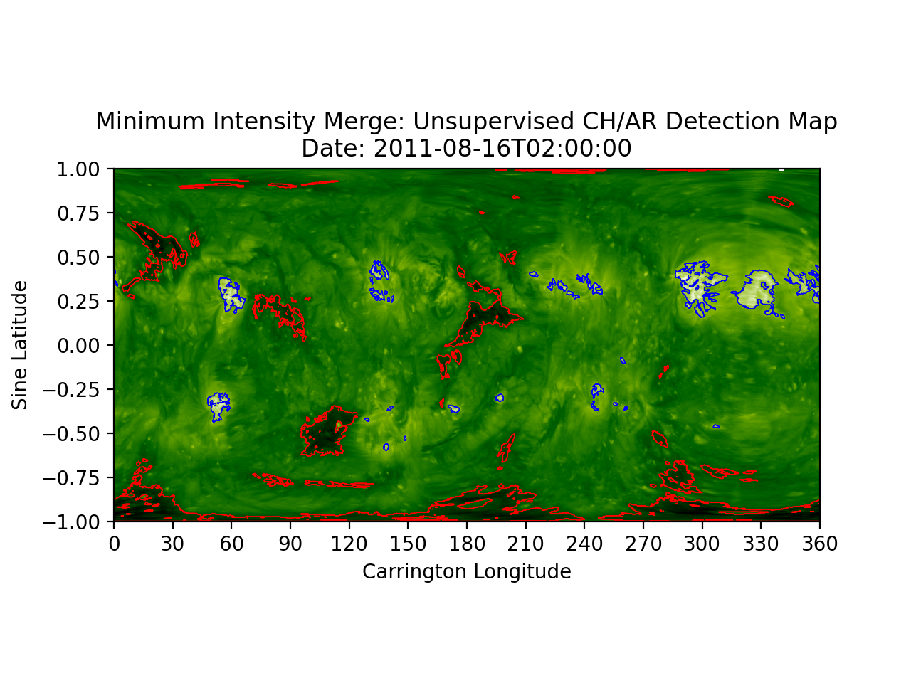

# Unsupervised Detection: K-Means Clustering

Unsupervised learning is a machine learning method through which unlabeled data is labelled.
The advantage of using unsupervised learning to detect coronal holes and active regions is that
it removes user interference and an individual's definition of a coronal hole from the process. 
Despite the minimal user interference, there are certain hyper parameters that must be selected 
by the individual and these have been optimized using various industry techniques to ensure that
we have the least amount of user interference as possible.  

The algorithm used for our unsupervised detection model is known as K-Means. This is an unsupervised
method of clustering. The basic idea is the algorithm assigns n samples/observations to k clusters whereby each
observation belongs to the cluster with the nearest cluster centroid. Each sample/observation receives a cluster label 
based on both spatial and intensity data, and these labels are then grouped into coronal holes and 
active regions. You can plot each detection individually, or both active regions and coronal holes on the 
same map.  

You can find the K-Means unsupervised detection pipeline code 
[here](https://github.com/predsci/CHD/blob/master/chmap/coronal_holes/ml_detect/examples/supervised_mapping_pipeline.py).   
The machine learning functions are found [here](https://github.com/predsci/CHD/blob/master/chmap/coronal_holes/ml_detect/tools/ml_functions.py).  

## K-Means Clustering

1. select cluster centers  
2. calculate distance between each sample and cluster centers  
3. assign data point to closest cluster center  
4. calculate new cluster centers  
5. recalculate the distance between each data point and newly obtained cluster centers  
6. continue until convergence  

** Figure: Basic Idea of K-Means Clustering. Each of the n samples are assigned to k clusters
based upon the closest cluster center. **

## Advantages  

* unsupervised  
    * no requirement of segmentation masks or labeling 
    * minimal user interference   
* easy to create multiple cluster types (find AR as well)  
* can basically regenerate EUV map — use for prediction  

## Example Images

Below we can see example images for both coronal hole detection and both 
coronal hole and active region detection for a synchonic map.   

####[CHD Unsupervised Map](images/unsupervised_chd.png)

####[CHD and ARD Unsupervised Map](images/unsupervised_chd_ard.png)

## Example Movies

Here are some example movies of coronal hole detection over short time spans.

<figure class="video_container">
  <iframe src="https://www.youtube.com/embed/DhoSU2QmRwM" frameborder="0" allowfullscreen="true"> </iframe>
</figure>

<figure class="video_container">
  <iframe src="https://www.youtube.com/embed/YxgkLmwfg_c" frameborder="0" allowfullscreen="true"> </iframe>
</figure>

<figure class="video_container">
  <iframe src="https://www.youtube.com/embed/LWBFJx3LN2U" frameborder="0" allowfullscreen="true"> </iframe>
</figure>

## Comparison with Brute Force Detection
We look to compare our unsupervised learning detection method with the 
brute force (EZSEG) detection method currently used. This comparison was done both 
visually and by plotting coronal hole areas over time.  

Here we can see a comparison of CH detection maps using the two different detection methods.  

[EZSEG Detection Map](images/ezseg_chd.png) | [Unsupervised Detection Map](images/unsupervised_chd.png)
:-: | :-: 
  | 

Additionally, we can look at a plot of CH areas over time. We see that the two methods follow the same
overall trend in area however the unsupervised method consistently detects less pixel-wise coronal hole 
area. There are some outliers which are the sharp spikes and these extras coronal holes often show up 
as flickering detections on large timescales.

[CH Area Comparison Plot](images/area_comparison.png)

